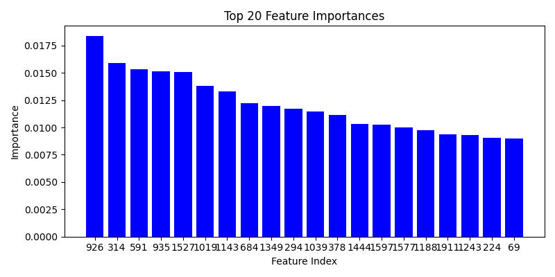
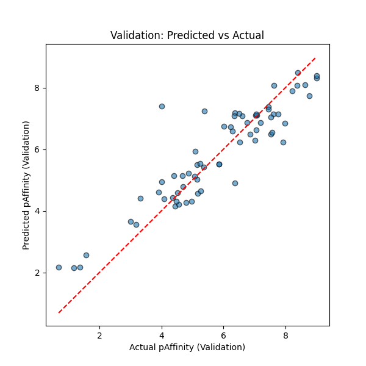
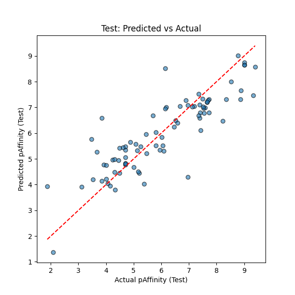
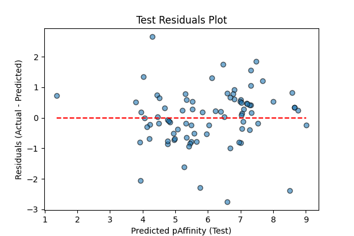

# AIREP: AI-Driven Inhibitor Recommendation for Beta-lactamase TEM



---

## Project Overview

AIREP (AI-driven RECommendation of inhibitors) is a machine learning project aimed at predicting potential small molecule inhibitors for the enzyme **Beta-lactamase TEM**, a key contributor to antibiotic resistance. The model leverages BindingDB experimental data and molecular fingerprints to learn structure-activity relationships and recommend promising candidates from chemical libraries.

---

## Motivation

Antibiotic resistance is a growing global health threat. Beta-lactamase TEM enzymes degrade β-lactam antibiotics, rendering many treatments ineffective. Identifying potent inhibitors to block this enzyme is critical. Experimental screening is costly and slow; AI-driven prediction accelerates discovery by narrowing candidates for lab testing.

---

## Project Components

- **Data Processing**:  
  Cleans and filters BindingDB data specific to Beta-lactamase TEM, extracting molecular structures (SMILES) and experimental affinities (Kd, IC50, Ki).

- **Feature Engineering**:  
  Converts SMILES to RDKit Morgan fingerprints (2048 bits, radius 2) as input features.

- **Modeling**:  
  Trains a Random Forest regressor using hyperparameter tuning (RandomizedSearchCV). Predicts binding affinity as pAffinity = -log10(affinity in M).

- **Evaluation**:  
  Model performance assessed with RMSE and R² on validation and test splits.

- **Recommendation Engine**:  
  Scores candidate molecules using the trained model and ranks them by predicted affinity.

- **Sequence Filtering**:  
  Filters target-like sequences from provided FASTA files based on keywords and length.

- **Web App**:  
  Flask interface to upload candidate molecules and obtain top inhibitor predictions.

---

## Installation

1. Clone the repository:
    git clone https://github.com/yourusername/airep.git
    cd airep

2. Install dependencies:
    pip install -r requirements.txt

3. Ensure you have the following files in the project root:
   - `BindingDB_All.tsv` (BindingDB dataset)
   - `BindingDBTargetSequences.fasta` (target protein sequences)

---

## Usage

### Training and Running the Web App

Run the script to train the model (if not cached) and start the Flask server:

    python3 main.py

- The model trains automatically on Beta-lactamase TEM data.
- Once running, open your browser at `http://localhost:5000`.
- Upload candidate SMILES and optionally a FASTA file (not required for Beta-lactamase TEM as local FASTA is used).
- Select top K recommendations and submit.

---

## Results and Visualizations

### Model Performance

- Validation RMSE: ~0.795  
- Test RMSE: ~0.901  
- Test R²: ~0.741

These metrics indicate the model predicts binding affinities with reasonable accuracy suitable for guiding experimental screening.

### Example Predictions

| SMILES                                                 | pAffinity | Predicted nM |
|--------------------------------------------------------|-----------|--------------|
| `[O-]C(=O)C1=CS[C@H]2N1C(=O)\C2=C/c1cn2CCOCc2n1`      | 9.052     | 0.9          |
| `[O-]C(=O)C1=CS[C@H]2N1C(=O)\C2=C\c1cnc2COCCn12`      | 9.025     | 0.9          |
| `ICC1CC(C(=O)O1)=C1O[C@@H]2CC(=O)N2C1C(=O)OCc1ccccc1`  | 9.009     | 1.0          |

### Generated Plots

**Validation: Predicted vs Actual**



---

**Test: Predicted vs Actual**



---

**Test Residuals**



---

**Top 20 Feature Importances**


---

## Project Structure
```
airep/
│
├── airep.py # Main script (training + Flask app)
├── BindingDB_All.tsv # BindingDB dataset (large TSV)
├── BindingDBTargetSequences.fasta # Target protein sequences
├── cache_.pkl # Cached filtered data by target
├── features_.npz # Cached fingerprint features
├── model_beta-lactamase_tem.joblib # Saved trained model
├── plots/ # Generated evaluation plots
│ ├── pred_vs_actual_val.png
│ ├── pred_vs_actual_test.png
│ ├── residuals_test.png
│ └── feature_importance.png
├── requirements.txt # Python dependencies
└── README.md # This file
```


---

## Future Work

- Expand model to other targets with minimal changes.
- Incorporate deep learning models (e.g., Graph Neural Networks) for improved affinity prediction.
- Integrate with experimental workflows for lab validation of predictions.
- Develop a more interactive web UI with visualization of molecular structures.

---

## References

- [BindingDB](https://www.bindingdb.org)  
- RDKit: Open-source cheminformatics software  
- Scikit-learn: Machine learning in Python

---

## Acknowledgements

Special thanks to the developers of RDKit, Scikit-learn, and the BindingDB team for making data and tools freely available.

---

## Contact

For questions or collaboration, please contact:  
**Isaaq Khanooni** — mohammadIsaaqK@gmail.com

---

*This project was developed for ISEF competition — combining AI, chemistry, and bioinformatics for drug discovery.*  
